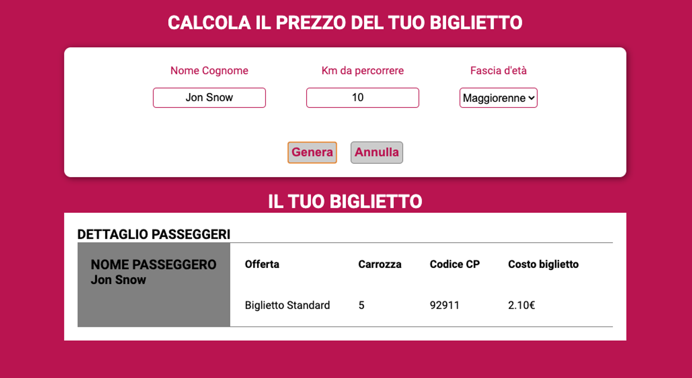

# Esercizio di oggi: Biglietto del treno DOM

## repo: `js-biglietto-treno-form`

### **`Descrizione:`** 
1. **Scrivere un programma che chieda all’utente:**
    
    - Il numero di chilometri da percorrere

    - Età del passeggero

1. **Sulla base di queste informazioni dovrà calcolare il prezzo totale del biglietto di viaggio, secondo le seguenti regole:**

    - il prezzo del biglietto è definito in base ai km (0.21 € al km)

    - va applicato uno sconto del 20% per i minorenni

    - va applicato uno sconto del 40% per gli over 65.

1. **L'output del prezzo finale va messo fuori in forma umana (con massimo due decimali, per 
indicare centesimi sul prezzo).**

### **`MILESTONE 1:`**
Iniziamo implementando il programma senza alcuna estetica: usando esclusivamente due input e un bottone (non stilizzati), realizziamo le specifiche scritte sopra. La risposta finale (o output) sarà anch’essa da scrivere in console.

### **`MILESTONE 2:`**
Solo una volta che la milestone 1 sarà completo e funzionante allora realizzeremo un form in pagina in cui l’utente potrà inserire i dati e visualizzare il calcolo finale con il prezzo.
Il recap dei dati e l'output del prezzo finale, andranno quindi stampati in pagina (il prezzo dovrà essere formattato con massimo due decimali, per indicare i centesimi sul prezzo).

>**`Nota:`**
Se non vi sentite particolarmente creativi, vi forniamo uno screenshot da seguire per il secondo milestone. Potete scegliere di implementare una soluzione completamente diversa oppure simile, ma in ogni caso cercate di farla vostra. 

### **`BONUS`**
- Aggiungere il tasto annulla per riportare i campi al valore originale

- Usare una select per inserire l'età

- Stampare sul biglietto un numero di carrozza e un numero di biglietto casuali

---
---
## **`Traccia:`**
